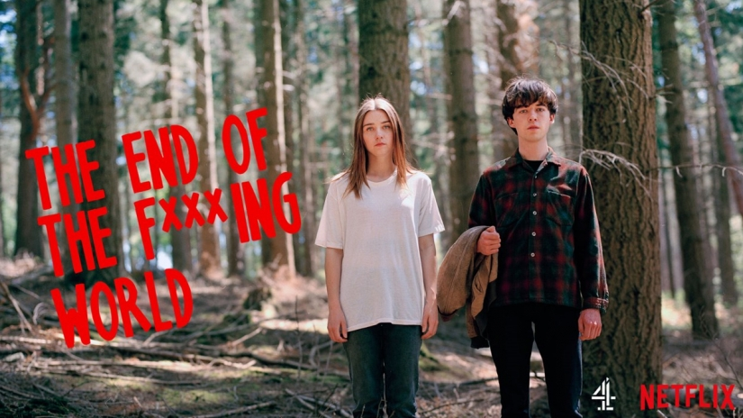

# app-dev
My first repository
# My favorite movie series
## Must watch yeahhh

- **Stranger things**
*is set in the fictional rural town of Hawkins, Indiana, in the 1980s. The nearby Hawkins National Laboratory ostensibly performs scientific research for the United States Department of Energy but also secretly experiments with the paranormal and supernatural, sometimes with human test subjects. They have inadvertently created a portal to an alternate dimension they refer to as the Upside Down, whose presence begins to affect the residents of Hawkins in unusual ways.*

- **End of the fucking world**
*is a British black comedy-drama television programme. The eight-part first series premiered its first episode on Channel 4 in the United Kingdom on 24 October 2017, after which the following episodes were released on All 4. Netflix handled international distribution and released it internationally on 5 January 2018. The programme follows James (Alex Lawther), a 17-year-old who believes himself to be a psychopath, and Alyssa Foley (Jessica Barden), an angry classmate who sees in James a chance to escape from her tumultuous home life. Gemma Whelan, Wunmi Mosaku, Steve Oram, Christine Bottomley, Navin Chowdhry, Barry Ward and Naomi Ackie appear in supporting roles.*
